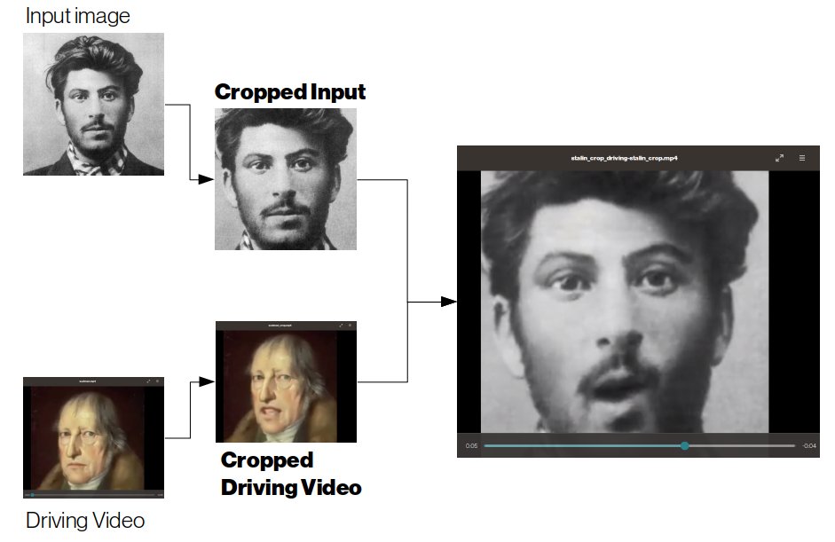
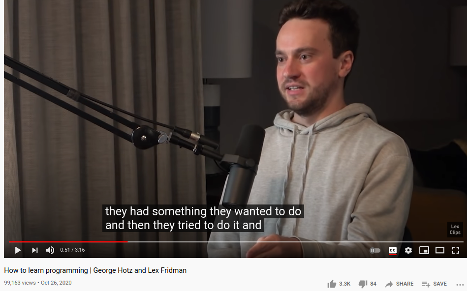

# First Order Motion Model for Image Animation

This repository contains the source code for the paper [First Order Motion Model for Image Animation](https://papers.nips.cc/paper/8935-first-order-motion-model-for-image-animation) by Aliaksandr Siarohin, [Stéphane Lathuilière](http://stelat.eu), [Sergey Tulyakov](http://stulyakov.com), [Elisa Ricci](http://elisaricci.eu/) and [Nicu Sebe](http://disi.unitn.it/~sebe/).

See original repo notes in https://github.com/AliaksandrSiarohin/first-order-model

## Petteri's notes for getting the repo to work 

### Pre-prerequisites

* Install [Anaconda3](https://www.anaconda.com/products/individual#windows) (if you have other Python 3.8 already, that is fine) ([installation instructions](https://docs.anaconda.com/anaconda/install/windows/))
* Install [Git](https://git-scm.com/book/en/v2/Getting-Started-Installing-Git), if you are `pull`ing this repo (you could just download the zip as well if you really do not know what this is)
* Install [`ffmpeg`](https://ffmpeg.org/download.html) 
* GO to terminal / command window here and execute the commands from there

### Clone this repository

```bash
git clone https://github.com/petteriTeikari/first-order-model-wrapper
cd first-order-model-wrapper
```

### Virtual environment setup

```bash
python3.8 -m venv venv-1stOrderModelMotion
source venv-1stOrderModelMotion/bin/activate
python3.8 -m pip install --upgrade pip
pip install -r requirements.txt
```

### PyTorch install

Check the one matching your OS and GPU situation

https://pytorch.org/

e.g. for Ubuntu 18.04 with a NVIDIA GPU

```
pip install torch==1.8.0+cu111 torchvision==0.9.0+cu111 torchaudio==0.8.0 -f https://download.pytorch.org/whl/torch_stable.html
```

### Other tasks to do 

* Download [`vox-cpk.pth.tar`](https://drive.google.com/file/d/1_v_xW1V52gZCZnXgh1Ap_gwA9YVIzUnS/view?usp=sharing) for face animation (provided by the original authors), and place the file to the subfolder `checkpoints`

* For cropping and preprocessing a youtube video (to get the face from it), you need to install [`face-alignment`](https://github.com/1adrianb/face-alignment) library (comes as preloaded with [an issue fixed for you]()):

```bash
cd face-alignment
pip install -r requirements.txt
python setup.py install
cd ..
```

### How to animate a static face from an image

TODO! Maybe make a nicer wrapper and do all on one-go



#### Prerequisite 1) Crop your static image 

E.g. portrait of yourself or some celebrity, "celebrity portrait" Google search gave young Stalin so it is our demo photo now

```
python crop-face-img.py --inp ./DATA_inputs/images/stalin.jpg
```

Takes around ~3 sec and adds the `_crop` suffix to your filename

```
Image cropped in 0:00:03.406049, and saved to ./DATA_inputs/images/stalin_crop.jpg
```

#### Prerequisite 2) Crop your driving video

E.g. you have downloaded some .mp4 file from youtube

```
python crop-video.py --inp ./DATA_inputs/driving_videos/scatman.mp4
```

That script actually does not do any cropping _per se_ but give you the command that you need to run on command line (and you need [`ffmpeg`](https://ffmpeg.org/download.html) installed for this), the command is displayed on the command window after the script execution, and with the `scatman.mp4`, it is the following (with the `crop.mp4` replaced with your actual output filename:

```
ffmpeg -i ./DATA_inputs/driving_videos/scatman.mp4 -ss 0.0 -t 8.8 -filter:v "crop=236:243:0:4, scale=256:256" ./DATA_inputs/driving_videos/scatman_crop.mp4
```

#### Actually animate

The `vox-256.yaml` is the configuration file used by the original author for the face animation, and the `.pth` is the pretrained model provided by the original authors

```
python demo.py  --config config/vox-256.yaml --driving_video ./DATA_inputs/driving_videos/scatman_crop.mp4 --source_image ./DATA_inputs/images/stalin_crop.jpg --checkpoint checkpoints/vox-cpk.pth.tar --relative --adapt_scale
```

Around real-time processing with `NVIDIA RTX 2070 Super`, i.e. 33.34 fps, `100%|█████████████| 264/264 [00:07<00:00, 33.34it/s]`

#### TODO! 

You could probably want just one call for all these steps, i.e. you are annoyed by all the cropping calls :P



From ["How to learn programming | George Hotz and Lex Fridman"](https://youtu.be/NjYICpXJ03M)

